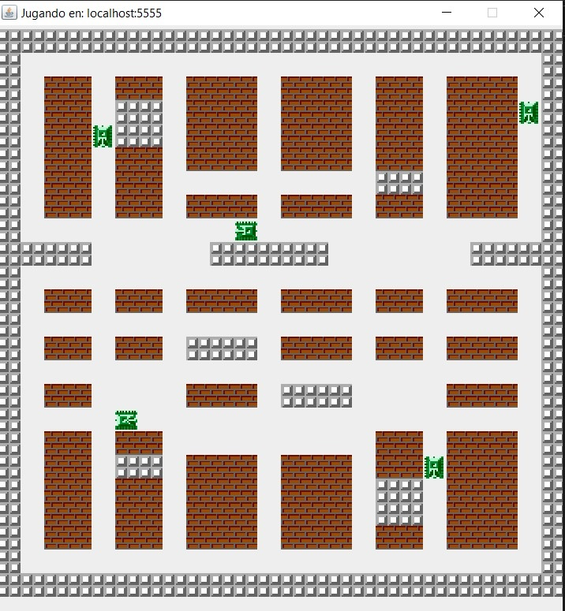

# Multithreaded Battle City in Java
we will develop the well-known game Battle City implementing a client-server
model. We opted for a distributed and concurrent approach where both server and client implement
threads to optimize performance. The server will continuously listen for new connections and will be in
charge of most of the processing needed. Clients will only have to worry about the GUI and after estab-
lishing the connection with the server, send keystrokes and receive the data needed to re-draw the map
and the tanks (other clients and themselves) within.

## How to play
Run the server:
```bash
java -jar BattleCityServer.jar
```
Run the client:
```bash
java -jar BattleCityClient.jar
```

## Screenshots

